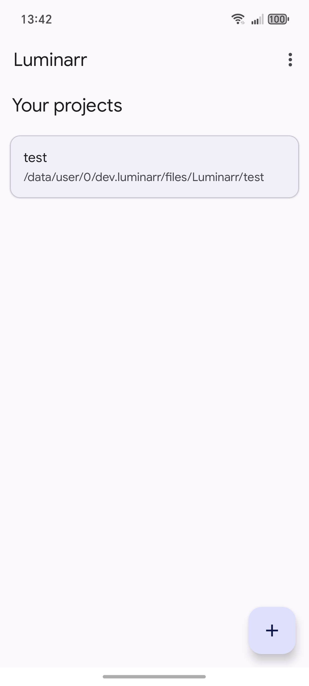
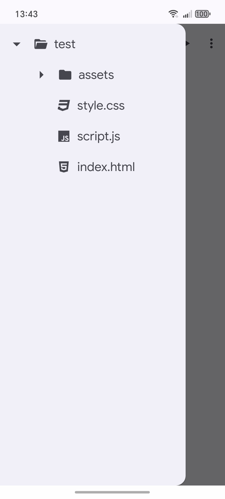
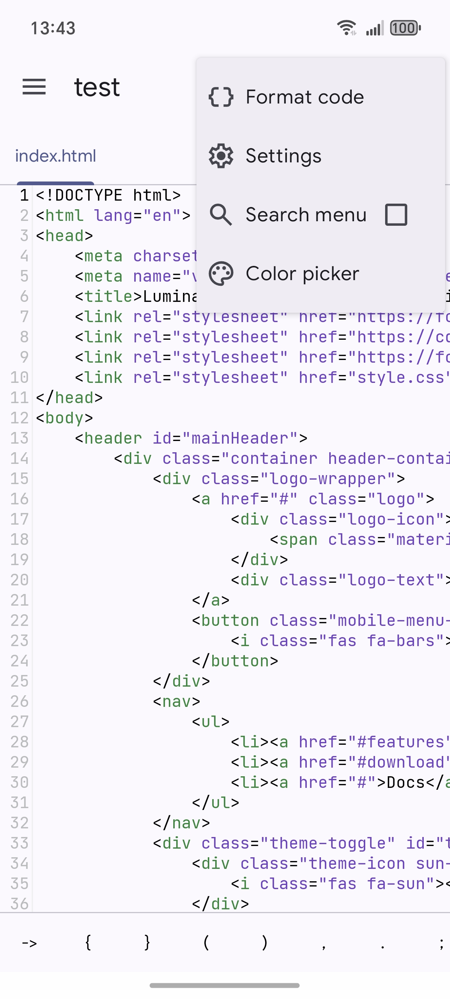
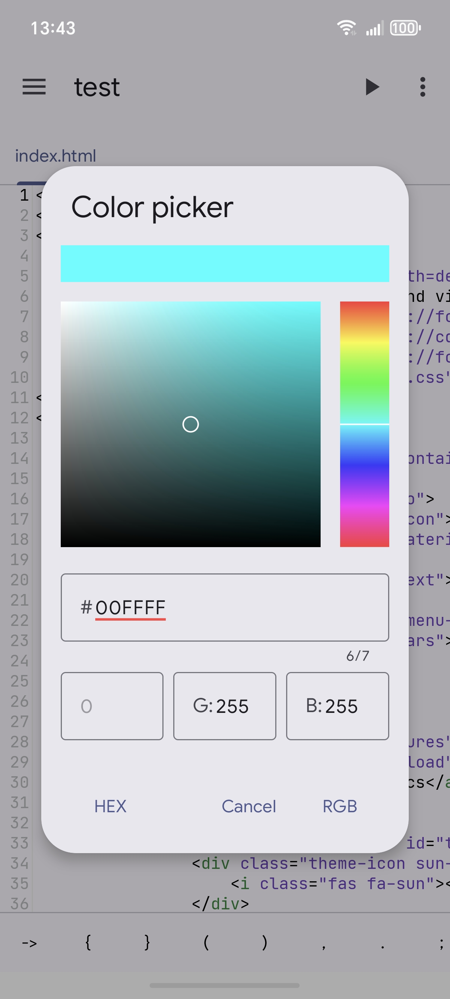
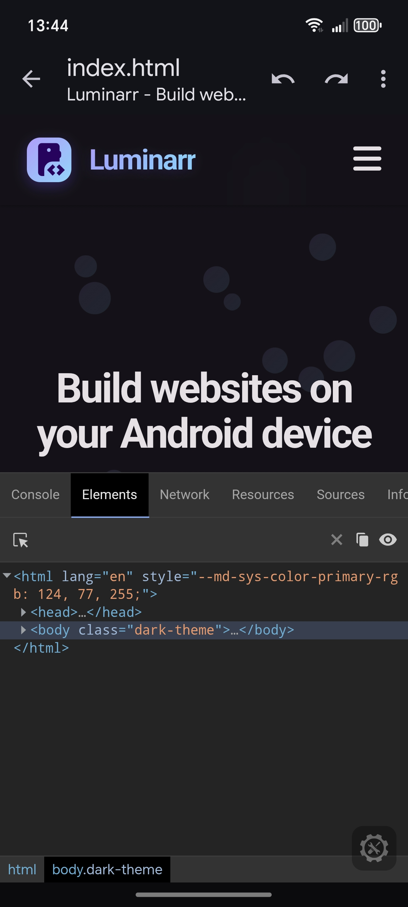
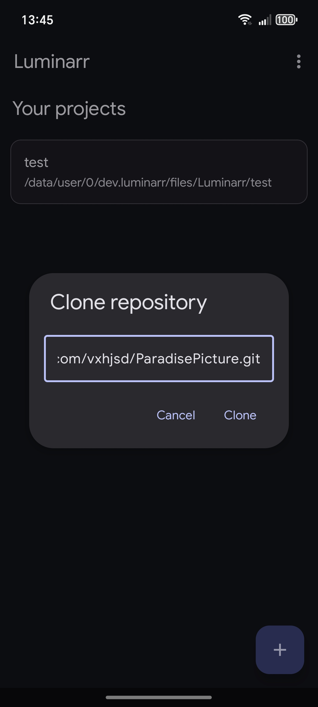
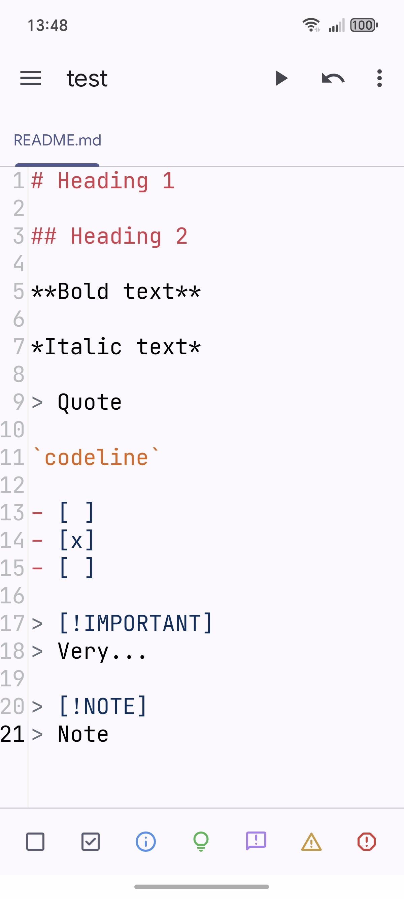
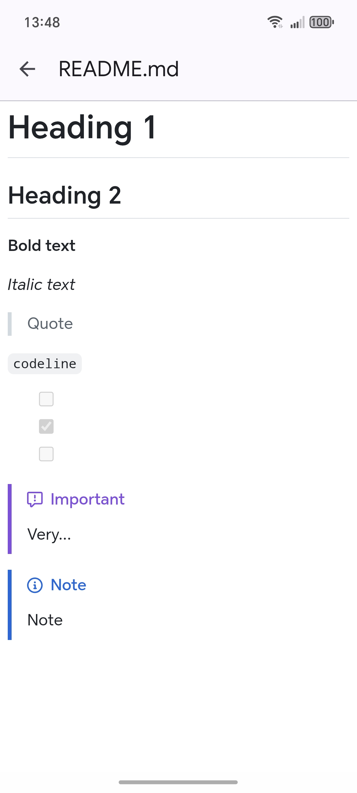

  

<h1 align="center">
✨ We Need Google Play Testers ✨
</h1>

  <b> Fast and beautiful IDE for creating websites right on your Android device </b>

 A detailed description of the app features and download links are available on the 
  <a href="https://cl33t.github.io/Luminarr/">website</a> 

## **Source Code**

Luminarr is a fork of Simple IDE. Although its own source code is not distributed, you can refer to the **[original Simple IDE repository](https://github.com/cl33t/Simple-IDE)**.

## **Screenshots**

  
  
   
  
  
   
  
  
  

## **Special thanks to:**
+ [XedoxDev](https://github.com/XedoxDev) for treeview base and color picker
+ [Rosemoe](https://github.com/Rosemoe) for SoraEditor
