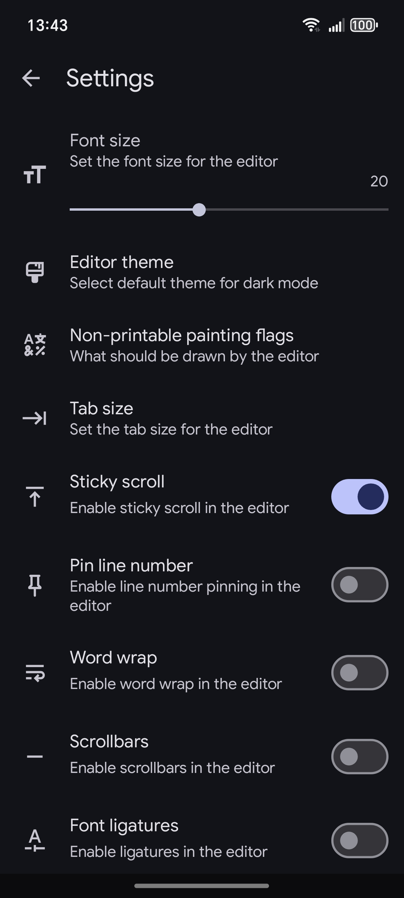

  

<h2 align="center"><b>Luminarr – Web Android IDE</b></h2>

  <b> Fast and beautiful IDE for creating websites right on your Android device </b>

 A detailed description of the app features and download links are available on the 
  <a href="https://vxhjsd.github.io/luminarr/">website</a> 

#

### Source Code

The source code for this project is not distributed, **but** since **Luminarr is written on top of [Simple IDE](https://github.com/vxhjsd/Simple-IDE/)**, their source codes are quite similar, so you **can** use the Simple IDE sources.
#

  
  
   
  
  
   
  
  
  

## Special thanks to:
+ [XedoxDev](https://github.com/XedoxDev) for treeview base and color picker
+ [Rosemoe](https://github.com/Rosemoe) for SoraEditor
